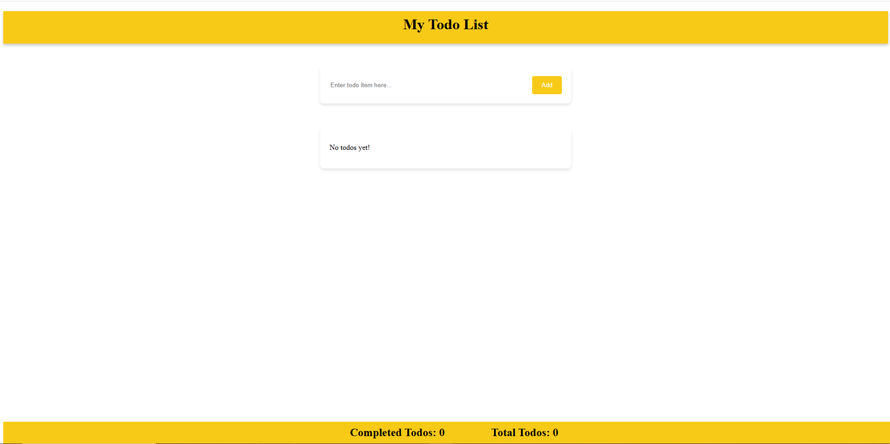
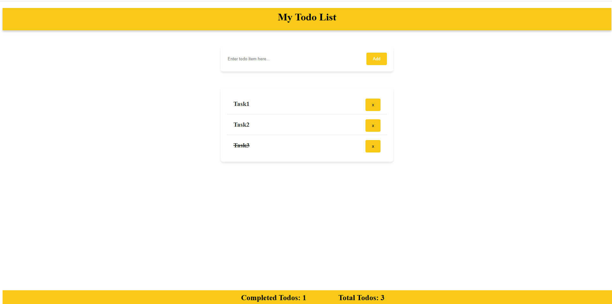

# 📝 My Todo List App

A simple and elegant **Todo List** application built using **Vite + Vanilla JavaScript**. This app allows users to add, delete, and mark tasks as complete, with a dynamic count of total and completed tasks.

## 🚀 Features

- ✅ Add new todos
- 🗑️ Delete existing todos
- ✔️ Mark/unmark todos as completed
- 📊 Realtime counter for total and completed tasks
- 💾 Todos persist during runtime (no DB/storage implemented yet)
- 📱 Responsive UI
- 🎨 Clean and simple layout

---

## 📂 Project Structure

TODO-APP/
├── .vscode/ # VSCode configuration files
├── node_modules/ # Project dependencies
├── src/ # Source files (HTML, JS, CSS)
│ └── (your logic files go here)
├── .gitignore # Git ignored files and folders
├── eslint.config.js # ESLint configuration
├── index.html # Main HTML file
├── package.json # Project metadata and scripts
├── package-lock.json # Auto-generated dependency lock file
├── README.md # Project documentation
└── vite.config.js # Vite configuration

---

## 🖥️ Screenshots

### 📌 Empty State

### 📌 Todo List With Tasks

---

## 🛠️ Installation and Setup

1. **Clone the repo:**
   git clone https://github.com/Web-Dev-Kombee/todo-app.git
   cd todo-app
2. **Install dependencies:**
    npm install
3. **Run the development server:**
    npm run dev
4. **Build for production:**
    npm run build

⚙️ Tech Stack
Vite – Fast build tool

Vanilla JavaScript – App logic

HTML5 & CSS3 – Markup and styling

📌 Todos Functionality
Adding Todos: Type a task and click Add to append it to the list.

Marking Completed: Clicking on a task toggles its completed state (with strikethrough effect).

Deleting: Click on the x button next to a task to remove it.

Footer Counter: Displays completed vs. total tasks dynamically.

🤝 Contributing
Pull requests are welcome. For major changes, please open an issue first to discuss what you would like to change.

📄 License
This project is open-source and available under the MIT License.

👩‍💻 Developed By
Khoosbu Patel – Frontend Web Developer
